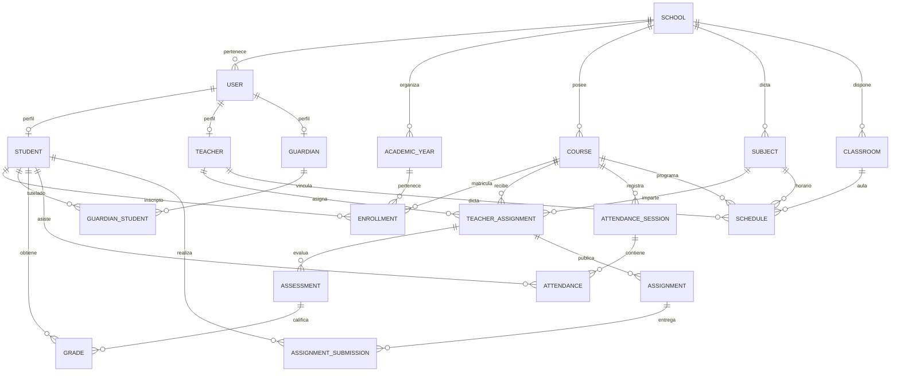

# 10. Diagrama Entidad-Relación (Mermaid ER)

El modelo de datos relacional de EduControl contempla la estructura completa de un colegio secundario técnico:

```mermaid
erDiagram
    SCHOOL ||--o{ USER : "pertenece"
    SCHOOL ||--o{ ACADEMIC_YEAR : "organiza"
    SCHOOL ||--o{ COURSE : "posee"
    SCHOOL ||--o{ SUBJECT : "dicta"
    SCHOOL ||--o{ CLASSROOM : "dispone"

    USER ||--o| STUDENT : "perfil"
    USER ||--o| TEACHER : "perfil"
    USER ||--o| GUARDIAN : "perfil"

    COURSE ||--o{ ENROLLMENT : "matricula"
    STUDENT ||--o{ ENROLLMENT : "inscripto"
    ACADEMIC_YEAR ||--o{ ENROLLMENT : "pertenece"

    GUARDIAN ||--o{ GUARDIAN_STUDENT : "vincula"
    STUDENT ||--o{ GUARDIAN_STUDENT : "tutelado"

    TEACHER ||--o{ TEACHER_ASSIGNMENT : "asigna"
    SUBJECT ||--o{ TEACHER_ASSIGNMENT : "imparte"
    COURSE ||--o{ TEACHER_ASSIGNMENT : "recibe"

    TEACHER_ASSIGNMENT ||--o{ ASSESSMENT : "evalua"
    ASSESSMENT ||--o{ GRADE : "califica"
    STUDENT ||--o{ GRADE : "obtiene"

    COURSE ||--o{ ATTENDANCE_SESSION : "registra"
    ATTENDANCE_SESSION ||--o{ ATTENDANCE : "contiene"
    STUDENT ||--o{ ATTENDANCE : "asiste"

    COURSE ||--o{ SCHEDULE : "programa"
    SUBJECT ||--o{ SCHEDULE : "horario"
    TEACHER ||--o{ SCHEDULE : "dicta"
    CLASSROOM ||--o{ SCHEDULE : "aula"

    TEACHER_ASSIGNMENT ||--o{ ASSIGNMENT : "publica"
    ASSIGNMENT ||--o{ ASSIGNMENT_SUBMISSION : "entrega"
    STUDENT ||--o{ ASSIGNMENT_SUBMISSION : "realiza"
```

