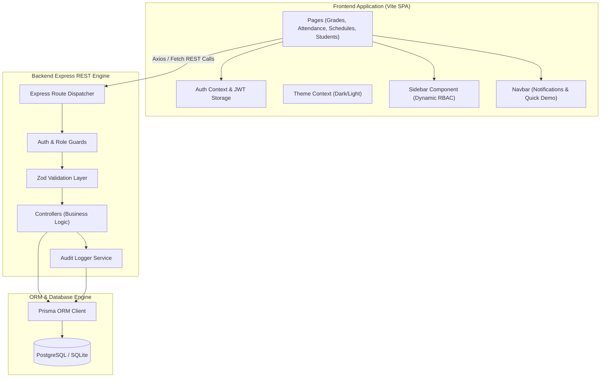

# 12. Diagrama de Componentes

```mermaid
graph TD
    subgraph FrontendApp ["Frontend Application (Vite SPA)"]
        AuthCtx["Auth Context & JWT Storage"]
        ThemeCtx["Theme Context (Dark/Light)"]
        SidebarComp["Sidebar Component (Dynamic RBAC)"]
        NavbarComp["Navbar (Notifications & Quick Demo)"]
        Pages["Pages (Grades, Attendance, Schedules, Students)"]
    end

    subgraph BackendAPI ["Backend Express REST Engine"]
        RouterLayer["Express Route Dispatcher"]
        AuthGuards["Auth & Role Guards"]
        Validators["Zod Validation Layer"]
        ControllersLayer["Controllers (Business Logic)"]
        AuditService["Audit Logger Service"]
    end

    subgraph DatabaseEngine ["ORM & Database Engine"]
        PrismaService["Prisma ORM Client"]
        DatabaseInstance[(PostgreSQL / SQLite)]
    end

    Pages --> AuthCtx
    Pages --> SidebarComp
    Pages --> NavbarComp
    Pages -->|"Axios / Fetch REST Calls"| RouterLayer
    RouterLayer --> AuthGuards
    AuthGuards --> Validators
    Validators --> ControllersLayer
    ControllersLayer --> AuditService
    ControllersLayer --> PrismaService
    AuditService --> PrismaService
    PrismaService --> DatabaseInstance
```

